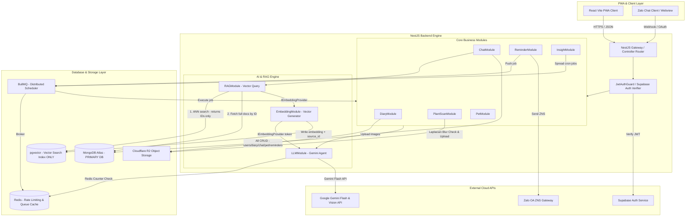
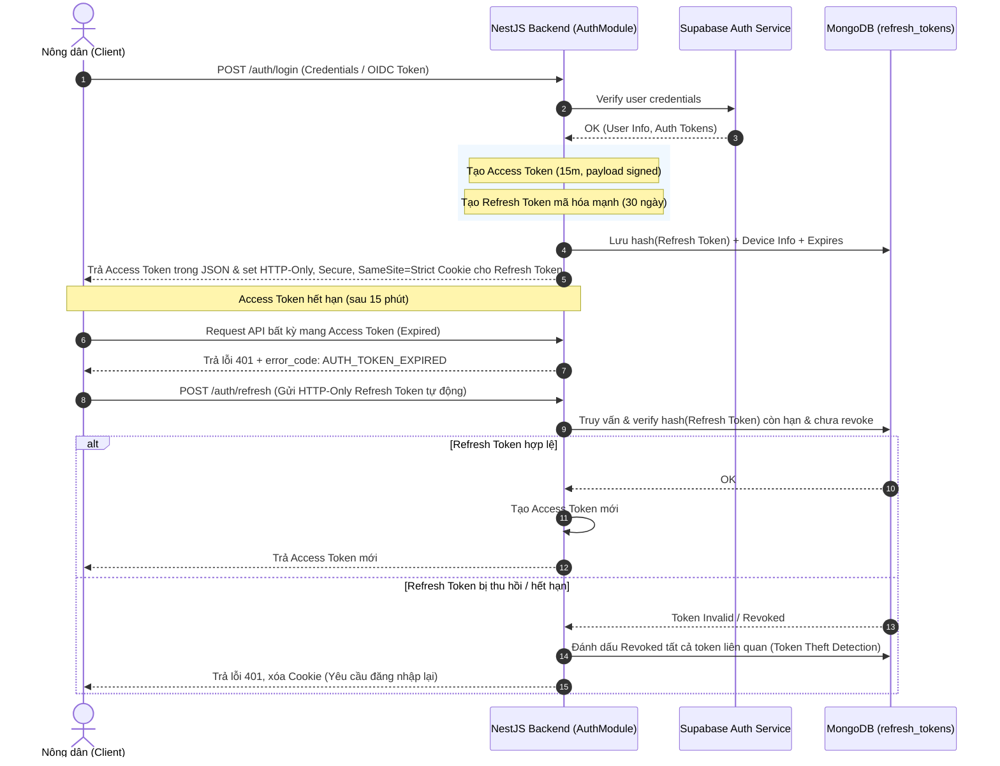
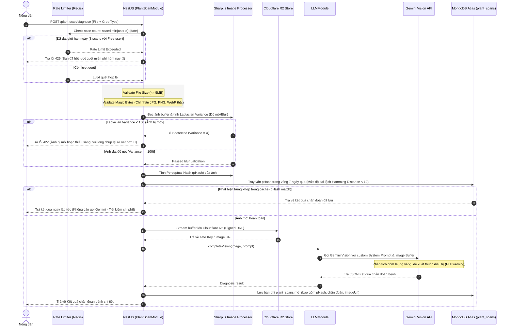
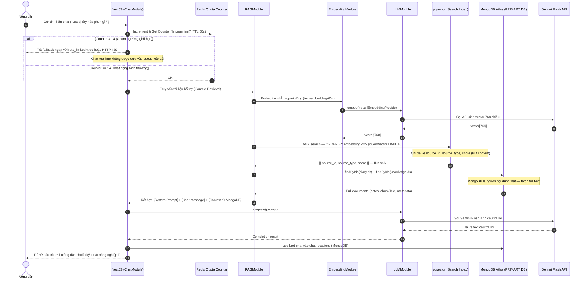
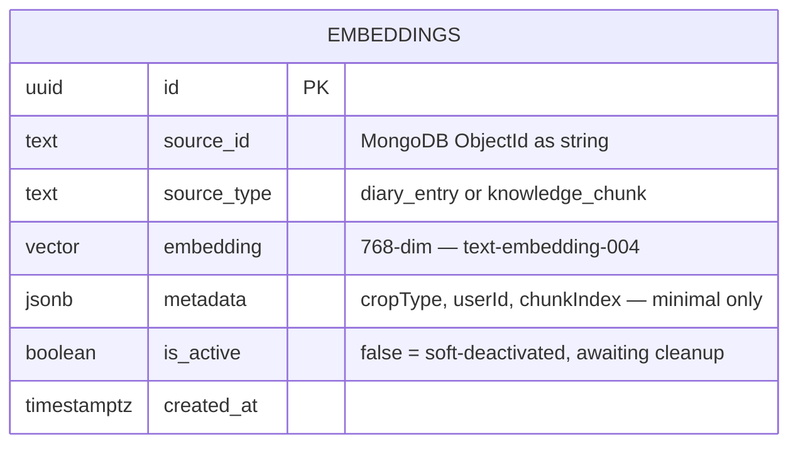

# FarmDiaries AI — Core Architecture Design Document (ADD)
### System Design · MongoDB Primary · pgvector Search Index · AI Pipeline · Security Blueprint

| Thuộc tính | Giá trị |
|---|---|
| **Dự án** | FarmDiaries AI (SDN392 Capstone Project) |
| **Tài liệu** | Core Architecture Design Document (ADD) |
| **Phiên bản** | v2.0 (MongoDB-primary · pgvector search index) |
| **Tác giả** | Team 4 - Antigravity Agentic Assistant |
| **Trạng thái** | Active · specs folder |

---

> **Architecture Decision:** MongoDB is the **primary database** for ALL application data. pgvector (PostgreSQL extension) is used **ONLY as a vector search index** — it stores `(embedding, source_id, source_type, minimal metadata)` and nothing else. No business data lives in pgvector. See `openspec/specs/embedding_spec.md` for full RAG architecture.

## 1. Bản đồ tổng quan Kiến trúc Hệ thống (System Architecture)

Hệ thống tuân thủ mô hình **Decoupled Modern Web PWA / Hybrid Cloud**, kết nối thông qua RESTful API tốc độ cao viết trên NestJS. Dưới đây là sơ đồ luồng dữ liệu và tương tác giữa các thành phần:



---

## 2. Request Lifecycle & Trình tự xử lý chính (Sequence Diagrams)

### 2.1 Luồng Xác thực & Quay vòng Access/Refresh Token (JWT Cookie Rotation)
Hệ thống sử dụng **Supabase Auth** để quản lý Identity, nhưng tự xoay vòng JWT thông qua HTTP-Only Cookie nhằm đảm bảo tính an toàn tối đa cho môi trường Web/PWA:



---

### 2.2 Quy trình Quét bệnh cây trồng (Plant Scan Validation & Vision Pipeline)
Để tránh spam API và đảm bảo chất lượng chẩn đoán từ ảnh chụp của nông dân, hệ thống triển khai pipeline kiểm chuẩn hình ảnh vô cùng nghiêm ngặt:



---

### 2.3 Luồng Trò chuyện RAG & Bảo vệ Quota (Gemini API Free-Tier Guard)
Cơ chế bảo vệ Quota miễn phí (15 RPM) của Gemini. RAG flow: embed query → pgvector search (returns IDs) → MongoDB fetch (full content) → assemble context → LLM.



---

## 3. Database Architecture — MongoDB Primary + pgvector Search Index

### 3.1 MongoDB Collections (Primary Database — Source of Truth)

All business data lives in MongoDB. See `openspec/specs/mongodb_stack_analysis.md` for the complete collection index plan.

| Collection | Stores | Key indexes |
|---|---|---|
| `users` | User profile, Zalo/push prefs, role, soft-delete | `email`, `zalo_user_id` |
| `refresh_tokens` | Token hash, family lineage, expiry, device | `token_hash` unique, `expires_at` TTL |
| `diary_entries` | Crop log, notes, photos, weather, location, flags | `user_id+created_at`, `user_id+crop_type` |
| `pet_states` | Current mood, streak, last diary timestamp | `user_id` unique |
| `pet_events` | Mood change history, milestones | `user_id+created_at` |
| `plant_scans` | Image metadata, pHash, AI diagnosis JSON | `user_id+created_at`, `p_hash` |
| `chat_sessions` | Message array, citations, AI metadata, TTL 90d | `user_id+updated_at`, `session_id` unique |
| `knowledge_chunks` | Technical content chunks, crop tags, quality score | `crop_type+quality_score` |
| `reminders` | Scheduled jobs, status, retry, channel | `status+scheduled_at`, `user_id` |
| `notification_subscriptions` | Push/Zalo/email destinations | `user_id` |
| `notification_logs` | Delivery outcomes | `user_id+created_at` |
| `weekly_insights` | Generated insight, delivery state, user feedback | `user_id+week_start_date` |
| `audit_logs` | Compliance records (append-only) | `user_id+created_at`, `action+created_at` |
| `user_events` | Product analytics events, TTL 30d | `user_id+created_at`, `event_type` |
| `farm_snaps` | Photo share, condition, reactions, XP | `user_id+created_at`, `is_public+created_at` |
| `ai_feedback` | Chat ratings, A/B test data | `user_id+created_at` |

### 3.2 pgvector — Search Index Only

pgvector hosts **one table only**: `embeddings(id, source_id, source_type, embedding vector(768), metadata jsonb, is_active bool, created_at)`.

No business data lives here. See `openspec/specs/embedding_spec.md` for the full schema and RAG flow.



> <!-- REVIEWER FLAG: pgvector must NOT contain users, diary_entries, pet_state, reminders, or any other business entity. Only the `embeddings` table is permitted. -->

---

### 3.3 MongoDB Document Examples

Tách biệt các dạng dữ liệu tần suất ghi cực cao, schema linh động và có thể lưu trữ ngắn hạn:

#### 1. Collection `chat_sessions` (Lưu lịch sử hội thoại có TTL 90 ngày)
*   **Mục đích:** Lưu tin nhắn dạng mảng lồng nhau, phục vụ giao diện chat dạng thread/session.
*   **Index đề xuất:**
    *   `{ user_id: 1, updated_at: -1 }` (Hiển thị danh sách hội thoại của người dùng)
    *   `{ session_id: 1 }` (Độc nhất, phục vụ lấy chi tiết cuộc hội thoại)
    *   `{ expires_at: 1 }` với thuộc tính `expireAfterSeconds: 0` (TTL tuyệt đối 90 ngày, được tính khi tạo/cập nhật retention).

#### 2. Collection `user_events` (Nhật ký hành vi nông dân với TTL 30 ngày)
*   **Mục đích:** Thu thập dữ liệu phục vụ nghiên cứu hành vi nông dân và cải tiến sản phẩm.
*   **Index đề xuất:**
    *   `{ userId: 1, createdAt: -1 }`
    *   `{ eventType: 1, createdAt: -1 }`
    *   `{ createdAt: 1 }` với thuộc tính `expireAfterSeconds: 2592000` (Dọn dẹp tự động sau 30 ngày).

#### 3. Collection `plant_scans` (Bản ghi chi tiết lịch sử chẩn đoán hình ảnh)
*   **Mục đích:** Lưu trữ chi tiết các ca bệnh thực tế được quét từ camera.
*   **Index đề xuất:**
    *   `{ userId: 1, createdAt: -1 }` (Lịch sử quét của người dùng)
    *   `{ pHash: 1 }` (Truy vết ảnh trùng lặp để phục vụ bộ đệm cache kết quả 7 ngày).

---

## 4. Kiến trúc phân lớp Backend NestJS (Clean Layered Architecture)

Backend được thiết kế chặt chẽ theo tư tưởng **Hexagonal / Clean Architecture**, phân tách rõ ràng trách nhiệm từ ngoài vào trong:

```
+-------------------------------------------------------------------------+
|                              LAYER 1: GATEWAY                           |
|       (Controllers, WebSockets, Zalo Webhooks, PWA Subscriptions)       |
+------------------------------------+------------------------------------+
                                     |
                                     |  DTOs & HTTP Requests
                                     v
+-------------------------------------------------------------------------+
|                            LAYER 2: APPLICATION                         |
|     (Guards, Pipes, Interceptors, Validation, Exception Filters)       |
+------------------------------------+------------------------------------+
                                     |
                                     |  Validated Data & User Context
                                     v
+-------------------------------------------------------------------------+
|                              LAYER 3: DOMAIN                            |
|             (Business Services, Pet Mood Rules, RAG Prompts)            |
+------------------------------------+------------------------------------+
                                     |
                                     |  Repository Interfaces
                                     v
+-------------------------------------------------------------------------+
|                          LAYER 4: INFRASTRUCTURE                        |
|  (Mongoose MongoDB [primary], pgvector [search index], BullMQ, Redis,   |
|   Cloudflare R2, Gemini API)                                            |
+-------------------------------------------------------------------------+
```

### 4.1 Quy tắc Tổ chức Module Chuẩn
Mỗi module bên trong [src/modules](file:///d:/coding/farmdiary/project/backend/src/modules) bắt buộc phải tuân thủ phân rã file như sau:
1.  `dto/`: Nơi định nghĩa các đối tượng truyền dữ liệu (DTO) với thư viện `class-validator` để kiểm chuẩn payload đầu vào từ client.
2.  `entities/` hoặc `schemas/`: Thực thể TypeORM (cho Postgres) hoặc Schema Mongoose (cho MongoDB).
3.  `controllers/`: Nơi xử lý router HTTP, định nghĩa Swagger, áp dụng Guards phân quyền.
4.  `services/`: Nơi chứa toàn bộ nghiệp vụ cốt lõi (Business Logic), không trực tiếp phụ thuộc vào cơ chế truyền tải HTTP.
5.  `module.ts`: Khai báo import, export rõ ràng các Controller và Service.

---

## 5. Kế hoạch Phòng vệ & Mô hình An ninh (Security Threat Model)

Hệ thống đặt bảo mật làm mặc định để bảo vệ tối đa dữ liệu của nông dân và các tài nguyên Cloud giá trị:

### 5.1 Phòng chống bypass header (Magic Bytes Validation)
Kẻ tấn công có thể đổi đuôi file `.exe` hay `.sh` thành `.jpg` hòng tải mã độc lên R2. Hệ thống kiểm duyệt kép buffer ảnh:
1.  **Multer File Extension Filter:** Kiểm tra Mime-type khai báo bởi client.
2.  **Magic Bytes Verification:** Đọc nội dung nhị phân (Binary Header) của buffer ảnh bằng thư viện `file-type`. Chỉ cho phép luồng chạy tiếp nếu byte mở đầu tương thích với định dạng JPG, PNG hoặc WebP thực thụ.

### 5.2 Ràng buộc quyền truy cập Object Storage (Cloudflare R2)
*   **Private Bucket:** Toàn bộ ảnh nhật ký canh tác (`diary_entries.photo_urls`) và ảnh quét bệnh (`plant_scans.imageUrl`) được lưu trữ tại private bucket của Cloudflare R2.
*   **Pre-signed URLs:** Backend không trả về URL tĩnh của ảnh. Thay vào đó, backend sử dụng thư viện `@aws-sdk/s3-request-presigner` để sinh các URL ký độc quyền có **thời gian hết hạn ngắn (TTL = 1 giờ)**. Sau 1 giờ, các liên kết này hoàn toàn vô hiệu, ngăn chặn rò rỉ dữ liệu nông trại ra internet.

### 5.3 Ngăn ngừa Tấn công chiếm dụng phiên (Token Theft Detection)
Nếu kẻ tấn công đánh cắp được `Refresh Token` từ máy người dùng:
*   Mỗi khi một Refresh Token được sử dụng, backend đánh dấu token cũ là `is_used=true` và tạo token mới trong cùng `family_id`.
*   **Token Theft Detection Logic:** Nếu backend phát hiện token đã dùng hoặc đã revoke được gửi lại, backend thu hồi toàn bộ token cùng family trong MongoDB:
    ```javascript
    await refreshTokens.updateMany(
      { family_id: compromisedFamilyId },
      { $set: { is_revoked: true } },
    );
    ```
*   Kết quả: Thu hồi ngay lập tức **toàn bộ các token cùng family** (không revoke token của các phiên khác), bắt buộc đăng nhập lại trên mọi thiết bị trong cùng chuỗi đó.

---

## 6. Giải thuật AI & Điều phối Chi phí (Cost Orchestration)

Vì dự án capstone ưu tiên sử dụng các gói miễn phí (Gemini API Free Tier), thuật toán phân phối tải thông minh được thiết lập nhằm tránh lỗi nghẽn dịch vụ `429 Too Many Requests`:

### 6.1 Giải thuật phân bổ tải Weekly Insight Cron (Chủ nhật 6:00 AM)
Nếu có $N$ người dùng hoạt động trong tuần, việc tạo báo cáo insight đồng thời sẽ gây nghẽn API ngay lập tức. Thuật toán phân bổ thời gian (Delay Spreading Algorithm) được áp dụng để rải đều tải trong vòng 4 tiếng (14,400 giây):

$$\text{Delay}_i = i \times \left( \frac{14400 \times 1000}{N} \right) \text{ miliseconds}$$

*Trong đó:*
*   $i$: Thứ tự của người dùng hoạt động trong mảng danh sách người dùng ($0 \le i < N$).
*   Công thức này giúp đảm bảo tần suất gọi API Gemini Flash luôn giữ ở mức an toàn dưới **10 RPM**, loại bỏ hoàn toàn khả năng chạm ngưỡng giới hạn của Free Tier (15 RPM).

### 6.2 Cấu hình Hàng đợi Phân cấp Ưu tiên (BullMQ Priority Queue)
BullMQ chỉ điều phối tác vụ nền; request tương tác realtime không chờ queue:

| Thứ hạng | Tác vụ | Ưu tiên (Priority) | Queue | Trải nghiệm người dùng |
|---|---|---|---|---|
| **1** | Tạo/cập nhật embedding | 3 | `embedding_queue` | Tác vụ nền, retry an toàn |
| **2** | Nhắc nhở công việc | 5 | `reminder_queue` | Chấp nhận độ trễ vài phút |
| **3** | Tổng hợp insight tuần | 10 | `insight_queue` | Chạy nền phân tán trong 4 giờ |

AI Chat và Plant Scan gọi `LLMModule` đồng bộ. Khi quota cạn, service retry ngắn theo policy rồi trả fallback hoặc HTTP 429; không tạo `llm_queue`.

### 6.3 AI Provider Abstraction

`LLMModule` là gateway duy nhất được phép gọi Gemini SDK. `LLMService` implement `IEmbeddingProvider`; `EmbeddingModule` và `RAGModule` chỉ inject token `IEmbeddingProvider` và không phụ thuộc concrete provider. DI phải dùng `useExisting: LLMService` để chat, vision và embedding dùng chung một gateway/rate-limit state.

---

*Tài liệu Core Architecture Design Document này là Source of Truth cho quá trình lập trình logic chi tiết của nhóm. Hãy tuân thủ nghiêm ngặt các quy chuẩn thiết kế để đảm bảo sản phẩm Capstone đạt tiêu chuẩn cao nhất.* 🌱
