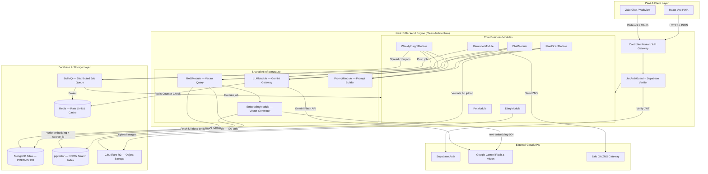
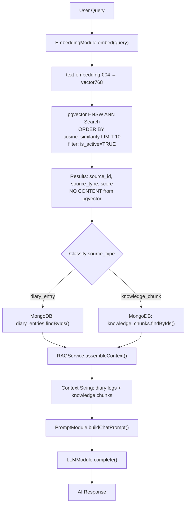
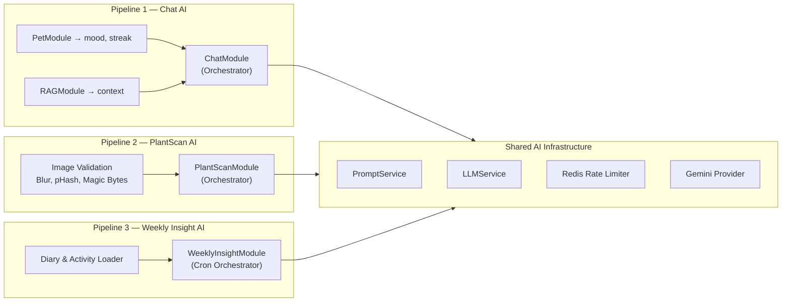
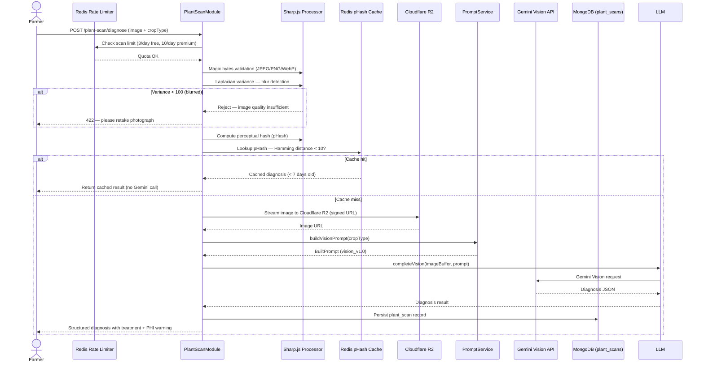

# FarmDiaries AI: An Intelligent Personalized Agricultural Assistant Leveraging Farm Memory, Retrieval-Augmented Generation, and Vision-Based Crop Disease Analysis for Smallholder Farmers

**SDN392 Capstone Project — Software Engineering Group 6**  
*Faculty of Software Engineering, FPT University*

---

## Abstract

Smallholder farmers in Vietnam face significant information asymmetry, limited access to agronomic expertise, and inadequate tooling for capturing and leveraging their own farm history. Existing digital agricultural solutions tend to provide generic recommendations divorced from individual farm context, fail to operate within the technological constraints of rural users, and remain inaccessible to farmers without formal agricultural education. This paper presents FarmDiaries AI, a Progressive Web Application (PWA) system that addresses these limitations through three tightly coordinated AI pipelines: (1) a Retrieval-Augmented Generation (RAG)-based conversational assistant that grounds responses in both verified agronomic knowledge and the user's personal farm diary history; (2) a computer vision pipeline leveraging Google Gemini Vision for real-timae crop disease diagnosis from smartphone photographs; and (3) an automated weekly insight generator that synthesizes farm activity into actionable recommendations. The system is built on a layered NestJS backend, MongoDB Atlas as the primary datastore, a pgvector HNSW index for sub-10-millisecond vector search, Redis-based rate limiting, and BullMQ for distributed scheduling. A gamification subsystem modeled on longitudinal habit-forming products ensures sustained engagement. We describe the system architecture, the Prompt-as-Code engineering approach, the dual-layer injection defense strategy, and an evaluation methodology spanning functional verification, RAG retrieval quality, LLM response accuracy, and user acceptance. FarmDiaries AI demonstrates that production-grade personalized agricultural intelligence is achievable within a zero-cost cloud infrastructure constraint, establishing a replicable blueprint for AI-augmented agricultural extension services in developing economies.

**Keywords:** Agricultural AI, Retrieval-Augmented Generation, Crop Disease Detection, Personalized Recommendation, Progressive Web Application, Prompt Engineering, Gemini Vision, pgvector, Smallholder Farming, Vietnam

---

## 1. Introduction

### 1.1 Background

Agriculture remains the backbone of Vietnam's rural economy, with approximately 40% of the labor force engaged in farming activities as of 2023. The majority of these farmers operate as smallholders — cultivating parcels of land typically under two hectares and growing a diverse range of crops including rice (lúa), citrus fruits (bưởi), coffee (cà phê), and vegetables. This demographic faces structural disadvantages that compound over time: limited exposure to updated agronomic research, infrequent access to local agricultural extension officers, and the cognitive burden of managing complex multi-crop farm operations without decision-support infrastructure.

The proliferation of mobile internet connectivity in rural Vietnam — with smartphone penetration exceeding 70% in agricultural provinces as of 2024 — creates a compelling opportunity to deliver AI-powered agronomic assistance directly into the hands of farmers. However, realizing this opportunity requires software systems designed for the specific constraints of the target population: low-bandwidth network conditions, limited formal literacy, preference for vernacular Vietnamese interaction, and workflows deeply embedded in daily agricultural practice rather than isolated digital sessions.

### 1.2 Problem Statement

Three interconnected problems define the gap that FarmDiaries AI addresses.

**The Knowledge Access Problem.** Agricultural knowledge in Vietnam remains concentrated in institutional sources — university extension services, government agricultural departments, and printed technical manuals — that are temporally infrequent and geographically constrained. A farmer experiencing an unfamiliar crop disease at harvest time may wait days or weeks for a qualified agronomist to respond. Generic agricultural chatbots, while increasingly available, cannot differentiate advice based on the specific crop varieties, soil conditions, historical interventions, or microclimate of a particular farm. The result is recommendations that are scientifically correct in the abstract but operationally useless for the individual farmer.

**The Farm Memory Problem.** Effective farm management depends on the accumulation and retrieval of operational history: which pesticide was applied and when, what growth stage a particular variety reached by a specific date, which fields showed disease pressure in the previous season. This institutional knowledge is overwhelmingly stored in the farmer's working memory or, at best, handwritten notebooks that resist search and synthesis. When a farmer encounters a recurring problem, they cannot systematically surface relevant patterns from their own history. Existing digital farm management tools provide diary functionality but stop short of extracting actionable intelligence from diary content.

**The Disease Identification Problem.** Plant disease identification is a specialized visual diagnosis task for which most farmers are not trained. Mis-identification leads to incorrect pesticide application, crop loss, and chemical residue risks that affect consumer safety. While laboratory-quality disease identification exists, it is inaccessible in the field. Smartphone-based disease detection represents a promising alternative, but existing solutions are trained on laboratory-condition datasets that poorly generalize to the varied lighting, occlusion, and image quality conditions of field photography in Vietnam.

### 1.3 Research Objectives

This work pursues the following research objectives:

1. Design and implement a modular AI infrastructure that cleanly separates LLM invocation, prompt construction, vector retrieval, and embedding generation into independently testable units.
2. Develop a Hybrid RAG architecture that combines domain-specific agricultural knowledge with per-user farm diary memory to generate personalized agronomic recommendations.
3. Implement a production-grade plant disease detection pipeline using Gemini Vision with a validation layer that filters low-quality inputs before LLM invocation.
4. Engineer a prompt construction subsystem with deterministic behavior, layered injection defense, and version-controlled templates.
5. Evaluate the system against quantitative metrics for retrieval quality, response accuracy, and user satisfaction.

### 1.4 Research Contributions

The primary contributions of this work are:

- A **Hybrid RAG architecture** that merges a curated agricultural knowledge base with dynamically embedded user diary entries, enabling responses grounded in both domain expertise and personal farm history.
- A **Prompt-as-Code engineering approach** (PromptService) that isolates prompt construction as a pure, deterministic, testable function with explicit version tracking and injection defense.
- An **image validation pipeline** for field-condition plant photography that applies perceptual hashing, Laplacian blur detection, and magic-bytes verification before LLM Vision invocation.
- A **cost-zero AI infrastructure design** leveraging Gemini Free Tier with Redis-based quota management and BullMQ distributed scheduling to remain within API rate limits while serving concurrent users.
- A **data flywheel design** (Farm Snap) that converts community photo sharing into labeled agricultural training data without explicit annotation burden on users.

---

## 2. Related Work

### 2.1 Digital Farming Systems

Digital farm management platforms such as Climate FieldView, Granular, and AgriWebb provide robust record-keeping, yield tracking, and decision support for large-scale commercial agriculture. However, these platforms presuppose farmers with internet-connected desktop workstations, formal accounting literacy, and operations at a scale that justifies subscription fees typically ranging from $10 to $50 per hectare per year. Studies by Kamilaris and Prenafeta-Boldú (2018) document the systematic exclusion of smallholder farmers in the Global South from precision agriculture benefits due to infrastructure gaps, language barriers, and economic constraints.

Vietnamese-specific agricultural platforms, including eFarm (VNPT) and the Ministry of Agriculture and Rural Development (MARD) information portals, provide valuable crop advisory content but offer minimal personalization, require fixed-format data entry misaligned with farmer workflows, and do not integrate conversational AI capabilities.

### 2.2 AI-Based Agricultural Assistants

Several AI chatbot systems for agriculture have been documented in the literature. Kisan Suvidha (India) and iCow (Kenya) represent early-generation rule-based assistants that provide pre-scripted responses to structured queries. More recent systems leverage large language models, including Pinto et al. (2023)'s adaptation of GPT-4 for crop advisory in Brazil and the AgroPilot project from the University of Wageningen, which deployed Claude-based recommendations for European smallholders.

A consistent limitation across these systems is the absence of personalized context. Responses are generated from system-level agricultural knowledge without access to the querying farmer's operational history. The FarmDiaries AI Hybrid RAG approach directly addresses this limitation by embedding diary entries alongside knowledge documents in the same vector index, enabling context-aware retrieval that surfaces both domain knowledge and personally relevant farm history.

### 2.3 Retrieval-Augmented Generation Systems

RAG systems, as formally described by Lewis et al. (2020) in the foundational Facebook AI Research paper, augment LLM generation with retrieved text passages to reduce hallucination and improve factual grounding. Subsequent work has explored dense passage retrieval (DPR), ColBERT-style late interaction models, and hybrid sparse-dense systems. For agricultural applications, Sharma et al. (2023) demonstrated that RAG outperforms vanilla LLM prompting for crop advisory by approximately 31% on factual accuracy metrics when evaluated against agronomist ground truth.

FarmDiaries AI adopts a Hybrid RAG design that retrieves from two distinct corpora simultaneously: a curated knowledge base of agricultural documents and the user's personal diary entries. This design extends standard single-corpus RAG with a personalization dimension that, to the authors' knowledge, has not been systematically implemented and evaluated in the agricultural domain in the Vietnamese context.

### 2.4 Plant Disease Detection Systems

Automated plant disease detection has advanced substantially since the PlantVillage dataset release by Hughes and Salathé (2015), which provided 54,306 labeled images across 26 diseases and 14 crop species. Mohanty et al. (2016) demonstrated 99.35% classification accuracy using deep convolutional neural networks trained on PlantVillage under controlled laboratory conditions, a result that proved substantially difficult to replicate in field conditions due to domain shift.

The PlantDoc dataset (Singh et al., 2020) addressed this limitation by collecting images in real field conditions, achieving 66.5% accuracy with state-of-the-art models on a 13-class problem — highlighting the substantial difficulty of field-condition disease detection. Subsequent work using EfficientNet (Tan and Le, 2019) and MobileNetV3 architectures has improved field accuracy while maintaining inference speed suitable for mobile deployment. YOLO-based classification approaches (Ultralytics, 2023) have enabled single-pass detection and classification pipelines suitable for real-time applications.

FarmDiaries AI adopts Google Gemini Vision for its MVP implementation, leveraging the model's zero-shot generalization capability to avoid dataset dependency. The future research direction involves fine-tuning EfficientNet or MobileNetV3 on a locally collected Vietnamese agricultural dataset seeded through the Farm Snap data flywheel.

---

## 3. System Overview

### 3.1 Product Vision

FarmDiaries AI is conceived as a personalized farm co-pilot for Vietnamese smallholder farmers. The product enables farmers to maintain a structured digital farm diary, receive AI-powered advisory grounded in both agricultural science and their own farm history, diagnose plant diseases from smartphone photographs, and receive automated weekly summaries of farm activity. A virtual pet mascot (Bé Thóc) provides an engagement layer modeled on the streak-based motivation mechanics of Duolingo, driving consistent diary entry behavior that in turn enriches the personalization layer.

### 3.2 Target Users

The primary target population comprises smallholder farmers in Vietnam with the following characteristics: (1) smartphone ownership with Android or iOS device and mobile internet connectivity; (2) cultivation of one or more food crops with a seasonal cycle; (3) limited formal agricultural education; (4) Vietnamese as primary language. Secondary users include agricultural extension officers who may use the platform's analytics and knowledge base management capabilities, and researchers who may access anonymized aggregate data.

### 3.3 Functional Scope

The MVP functional scope encompasses six primary feature areas:

| Feature Area | Description | Phase |
|---|---|---|
| Digital Diary | Structured daily farm records with photo attachment and crop tagging | 1 |
| AI Chat Assistant | RAG-powered conversational agricultural advisor | 1 |
| Virtual Pet | Rule-based mood and streak gamification layer | 1 |
| Reminder System | Scheduled push notifications via Zalo ZNS and Web Push | 1 |
| Farm Snap | Instant photo sharing with AI training data labeling | 2 |
| Plant Disease Scan | Gemini Vision crop diagnosis with image validation | 3 |

Features explicitly deferred from MVP include social networking (follows, comments, direct messages), marketplace integration, supply chain traceability, and fine-tuned local disease detection models.

### 3.4 Non-Functional Requirements

The system is designed to satisfy the following non-functional requirements:

- **Availability:** ≥ 99.5% uptime for core chat and diary functions.
- **Response Latency:** AI chat responses < 3 seconds under normal Gemini API availability; < 10 seconds under queue-managed rate limiting.
- **Vector Search Latency:** pgvector HNSW index query completion < 10 ms at p99 for collections up to 100,000 embeddings.
- **Security:** JWT with 15-minute access token TTL, httpOnly refresh token cookie, token family revocation on theft detection, magic-bytes file validation.
- **Privacy:** Diary content encrypted at rest; no business data stored in derived search indices; GDPR-aligned data retention with configurable TTL.
- **Cost:** Zero infrastructure cost during development and initial deployment, achievable through Gemini Free Tier (15 RPM Flash, 100 RPM Embedding), MongoDB Atlas free tier, and Cloudflare R2 free tier.

---

## 4. System Architecture

### 4.1 Architectural Overview

FarmDiaries AI follows a Decoupled Modern Web PWA / Hybrid Cloud architecture. The React Vite PWA client communicates exclusively with the NestJS backend via HTTPS RESTful APIs. The backend implements a Hexagonal (Clean) Architecture with four explicit layers: Gateway (controllers, webhooks), Application (guards, pipes, interceptors), Domain (business services, AI pipeline), and Infrastructure (MongoDB, pgvector, Redis, BullMQ, Cloudflare R2, Gemini API).



**Figure 1. FarmDiaries AI System Architecture.** MongoDB is the exclusive source of truth for all business data. pgvector serves as a derived, rebuildable vector search index. All LLM calls are routed through the singleton LLMModule.

### 4.2 Database Layer Design

A deliberate architectural decision separates data storage into two distinct roles. MongoDB Atlas serves as the **primary database** for all application data: user profiles, diary entries, chat sessions, pet states, plant scan records, weekly insights, reminders, audit logs, and knowledge content. pgvector, running as a PostgreSQL extension, serves exclusively as a **vector search index** containing a single table (`embeddings`) that stores `(source_id, source_type, embedding vector[768], minimal metadata)` with no business data. This separation provides two key properties: (1) if the pgvector index is lost, it can be fully reconstructed from MongoDB by re-running the embedding pipeline; (2) all data access for read and write operations in application code targets MongoDB, preserving a single coherent source of truth.

This design was chosen over MongoDB Atlas Vector Search after analysis of latency and cost characteristics. pgvector with an HNSW index (m=16, ef_construction=64) delivers sub-10ms p99 ANN search, compared to 50–200ms for Atlas Search, which additionally requires an M10+ cluster at a minimum cost of $57/month — prohibitive for a zero-cost MVP constraint.

### 4.3 Caching and Queue Architecture

Redis serves three roles: (1) rate limit counters for Gemini API quota enforcement (two independent keys — `llm:rpm:flash` for Gemini Flash and `llm:rpm:embed` for embeddings); (2) short-lived cache state; and (3) BullMQ broker state. BullMQ is reserved for background work: `embedding_queue`, `reminder_queue`, and `insight_queue`. Interactive chat and plant scans use short retries and then return a fallback or HTTP 429; they are never held in a long-running queue.

### 4.4 Object Storage

Cloudflare R2 (S3-compatible API) hosts all binary assets: diary entry photographs, plant scan images, and Farm Snap photos. The backend never serves static assets directly; instead, it issues short-lived pre-signed URLs (TTL = 1 hour) for client download and short-lived signed PUT URLs (TTL = 5 minutes) for client upload. File uploads are validated at two layers: MIME type filtering via Multer `fileFilter`, and magic-bytes verification using the `file-type` library to detect MIME spoofing.

### 4.5 Notification Architecture

The notification system implements a priority chain: PWA Web Push (if installed) → Zalo ZNS template messages (if user has connected Zalo Official Account) → email fallback via Resend. Zalo ZNS was selected as the primary channel because Zalo maintains a penetration rate significantly exceeding email among rural Vietnamese smartphone users, with ZNS template message open rates reported at approximately 80% versus 20% for email. Template messages require pre-approval from Zalo; five templates are planned covering diary reminders, water reminders, weekly insight delivery, streak milestone celebration, and plant alert.

---

## 5. AI Architecture

FarmDiaries AI separates AI concerns across four independent modules that interact through well-defined interfaces, enabling independent development, testing, and deployment.

### 5.1 LLMModule — Gemini Gateway

LLMModule is the **singleton gateway** for all Gemini API calls. No other module may invoke Gemini directly; all invocations pass through the LLMModule interface. This enforces a consistent policy for rate limiting, retry logic, token logging, and fallback behavior.

The module exposes three primary methods:

- `complete(options: LLMCompleteOptions): Promise<LLMCompleteResult>` — text generation via Gemini Flash.
- `completeVision(imageBuffer, prompt, promptVersion)` — multimodal generation via Gemini Vision.
- `embed(text: string): Promise<LLMEmbedResult>` — 768-dimensional vector generation via text-embedding-004.

Rate limiting is implemented via two independent Redis counters with 60-second TTL windows. When the Flash counter exceeds 14 RPM (one below the 15 RPM free-tier limit), the module either returns a fallback message (for interactive chat) or throws `LLMRateLimitedException` (for background jobs). Retry logic applies exponential backoff with base delay 1 second and maximum 3 attempts before invoking the fallback path. All successful completions are logged with model identifier, latency in milliseconds, prompt token count, completion token count, and prompt version string.

### 5.2 PromptModule — Deterministic Prompt Builder

PromptModule implements the **Prompt-as-Code** approach: prompt construction is isolated as a pure, side-effect-free service that accepts structured input data and returns a versioned `BuiltPrompt` object containing the assembled prompt string and metadata. The module exposes three builder methods corresponding to the three AI pipelines:

- `buildChatPrompt(input: BuildChatPromptInput): BuiltPrompt`
- `buildVisionPrompt(input: BuildVisionPromptInput): BuiltPrompt`
- `buildWeeklyInsightPrompt(input: BuildWeeklyInsightPromptInput): BuiltPrompt`

**Determinism requirement:** Given identical input parameters, builder methods must produce byte-identical output strings. No internal use of `Date.now()`, `Math.random()`, or other non-deterministic operations is permitted.

**Injection defense:** Two independent sanitization functions apply a blocklist regex to user-supplied content before injection into templates. Patterns including `[SYSTEM]`, `[INST]`, `ignore previous instructions`, `forget your instructions`, `you are now`, `act as`, and LLM special token patterns (`<|...|>`) are replaced with blocked marker strings. Separate functions handle user messages (`sanitize()`) and external context (`sanitizeContext()`), enabling independent extension of each blocklist.

**Structural defense:** Templates implement DATA ONLY wrapper markers that instruct the LLM to treat injected sections as read-only data rather than executable instructions. All user-originated content sections are bounded by explicit boundary markers.

**Truncation:** Character limits are applied independently to user messages (2,000 characters), RAG context (6,000 characters), and conversation history (4,000 characters, retaining the most recent 6 turns). Truncation preserves the most recent content by slicing from the left.

The `BuiltPrompt` return type carries a `promptVersion` field that is passed to LLMModule for logging, enabling A/B testing and regression detection when templates are modified.

### 5.3 RAGModule — Hybrid Context Retrieval

RAGModule implements the context retrieval pipeline for the Chat AI and Weekly Insight AI pipelines. The retrieval process follows five sequential steps:



**Figure 2. RAG Context Retrieval Pipeline.** pgvector returns only source identifiers; full document content is always fetched from MongoDB.

The Hybrid RAG design retrieves simultaneously from two corpus types: knowledge chunks (verified agricultural documents uploaded by administrators) and diary entries (user-authored farm records). This enables responses that reference both *"coffee rust typically presents with orange spore masses on the underside of leaves"* (knowledge corpus) and *"you last treated your coffee plot with fungicide 14 days ago"* (diary corpus). The minimum cosine similarity threshold for retrieval is 0.7; retrieved documents are ranked by score and assembled in descending similarity order up to a combined character budget of 6,000 characters.

### 5.4 EmbeddingModule — Vector Index Management

EmbeddingModule manages the lifecycle of vector embeddings in the pgvector search index. Embeddings are created asynchronously via BullMQ jobs, decoupled from the synchronous MongoDB write that precedes them. This Dual Write pattern ensures data integrity: if the embedding job fails, the diary entry is safely preserved in MongoDB and only search coverage is temporarily reduced. Failed jobs are retried up to three times with exponential backoff before alerting.

Text chunking strategy differs by source type. Diary entry notes shorter than 20 characters are skipped as semantically insufficient. Notes between 20 and 500 characters are embedded as a single chunk. Notes exceeding 500 characters are segmented using a sliding window of 300 characters with 100-character step size, producing a maximum of 10 chunks per entry. Knowledge documents use a wider window of 500 characters with 150-character step size and a maximum of 50 chunks per document, reflecting the more information-dense nature of technical agricultural content.

### 5.5 Three AI Pipelines

The three AI pipelines are architecturally independent, sharing only the Shared AI Infrastructure (LLMModule, PromptModule, Redis rate limiter, Gemini provider).



**Figure 3. Three Independent AI Pipelines with Shared Infrastructure.**

---

## 6. Personalized Farm Memory

### 6.1 From Generic Chatbot to Personal Farm Advisor

Generic agricultural chatbots answer the question *"What disease affects rice during the tillering stage?"* with reference to population-level agronomic knowledge. FarmDiaries AI answers a richer question: *"Given that this specific farmer's rice field in An Giang was last treated for brown planthopper 11 days ago, that soil moisture was recorded as low in four of the past seven diary entries, and that local weather data shows elevated humidity this week, what is the most appropriate intervention?"* This transformation from generic to personalized requires treating the farmer's diary history as operational memory.

### 6.2 Diary as Farm Memory

Each diary entry captures: crop type, growth stage, free-text observations (notes), photographs, watering and fertilization events, weather context, and geographic location. Upon creation, entries are persisted in MongoDB (synchronously) and enqueued for embedding (asynchronously). Once embedded, diary entries become retrievable via semantic similarity search, making the farmer's accumulated operational knowledge addressable by natural language query.

Three distinct roles are served by diary data:

1. **UI History Layer:** The diary list view provides a chronological operational record.
2. **RAG Memory Layer:** Embedded diary chunks are retrieved as context for AI chat, enabling responses grounded in the farmer's specific history.
3. **Weekly Insight Source:** The past seven days of diary entries are synthesized by the Weekly Insight pipeline into an automated farm activity summary with forward-looking recommendations.

### 6.3 Knowledge Base Integration

The agricultural knowledge base consists of curated technical documents — crop management guides, disease identification references, best practice advisories, and pesticide application guidelines — uploaded and reviewed by administrators. These documents are chunked, embedded, and indexed in the same pgvector table as diary embeddings, differentiated by `source_type`. The RAG retrieval pipeline queries both sources simultaneously, enabling responses that interleave personal farm context with validated agronomic science.

### 6.4 Pet State as Behavioral Context

The virtual pet (Bé Thóc) maintains a rule-based mood state derived from the farmer's diary entry streak and the recency of the most recent entry. Mood values (`happy`, `excited`, `neutral`, `sad`, `worried`, `sleepy`, `hungry`) are passed into the chat prompt to enable the AI to acknowledge the farmer's engagement state. A farmer with a seven-day streak receives encouragement; a farmer whose pet mood has declined to `sad` due to diary absence receives a gentle nudge toward re-engagement. This creates a closed feedback loop where AI responses actively support the behavioral patterns (consistent diary entry) that improve AI response quality.

---

## 7. Plant Disease Analysis

### 7.1 MVP Implementation — Gemini Vision Pipeline

The current MVP plant disease detection pipeline delegates classification to Google Gemini Vision, leveraging its zero-shot visual understanding capability to analyze crop photographs without task-specific model training.



**Figure 4. Plant Disease Scan Pipeline.** Validation layers prevent low-quality images and duplicate API calls. The structured output mandates inclusion of pesticide Pre-Harvest Interval (PHI) warnings.

The vision prompt is designed to elicit a structured JSON response containing: `is_plant` (boolean), `disease` (string), `confidence` (float 0–1), `symptoms` (string array), `treatment.chemical`, `treatment.organic`, `treatment.phi_warning`, `low_confidence_warning`, and `disclaimer`. The `low_confidence_warning` field is mandatory when confidence falls below 0.6, and PHI warning inclusion is enforced structurally in the prompt rather than relying on model judgment. If the input image is not identified as a plant (`is_plant: false`), the pipeline returns a structured negative result without a disease classification.

### 7.2 Image Validation Layer

Three validation mechanisms prevent unnecessary API calls and improve diagnosis quality:

**Blur Detection.** The Laplacian variance of the image is computed using Sharp.js. Images with Laplacian variance below a threshold of 100 are rejected as insufficiently sharp for reliable disease feature extraction. Farmers are prompted to retake the photograph with better focus or lighting.

**Perceptual Hash Caching.** A perceptual hash (pHash) is computed for each accepted image. Incoming images with pHash Hamming distance less than 10 from a cached scan within the past 7 days return the cached diagnosis without invoking Gemini. This eliminates redundant API calls for semantically identical images from the same or similar field conditions.

**Magic Bytes Validation.** The binary header of each uploaded file is inspected using the `file-type` library to verify that the actual file format matches the declared MIME type. This prevents MIME spoofing attacks where executables or scripts with renamed extensions are submitted as images.

### 7.3 Future Research Direction — Fine-Tuned Computer Vision

The MVP Gemini Vision approach provides practical utility but faces limitations: response latency (5–10 seconds for vision API round-trip), dependency on external API availability, and potential inconsistency in structured output format across model versions. Future research will investigate locally deployable computer vision models trained on Vietnamese field-condition datasets.

The Farm Snap data flywheel provides the foundational dataset collection mechanism. Each Farm Snap contributed by community members constitutes a labeled sample: the crop type and condition label (healthy, issue, harvest, other) are provided by the uploading farmer as part of the sharing interface, and geographic metadata, weather conditions, and timestamp are collected automatically. Administrators may review and quality-score samples; quality-scored samples are exportable as JSONL datasets for model training.

Candidate architectures for future plant disease classification include:

- **EfficientNet-B4:** Demonstrated strong performance on plant disease datasets in the literature, particularly effective for multi-class classification tasks with compact model footprint.
- **MobileNetV3:** Optimized for mobile inference latency, enabling potential on-device deployment for offline scenarios.
- **YOLO Classification:** Single-pass architecture suitable for real-time classification directly within a camera viewfinder, enabling immediate feedback during image capture.

A locally-hosted model would eliminate API latency and external dependency, enabling offline disease detection capability particularly valuable in low-connectivity rural environments.

---

## 8. Implementation

### 8.1 Frontend Stack

The client application is implemented as a Progressive Web Application using React 18, Vite build tooling, and TypeScript. Styling uses Tailwind CSS with Shadcn/UI component primitives. State management employs Zustand for local application state and TanStack Query for server state synchronization with cache invalidation. PWA capabilities are implemented via `vite-plugin-pwa`, providing service worker-based offline caching and installability on both Android and iOS. The application is designed mobile-first for portrait-orientation smartphone use.

### 8.2 Backend Stack

The backend is built on NestJS 10 with TypeScript strict mode. The module system enforces the separation of controllers, services, DTOs, and repository interfaces within each feature domain. Input validation uses class-validator decorators applied at the DTO layer. Authentication is implemented via Supabase Auth as identity provider with NestJS Passport JWT strategy for request authorization. The Guard/Interceptor/Filter pattern enforces cross-cutting concerns (authentication, logging, exception formatting) without contaminating business logic.

### 8.3 Database Layer

MongoDB Atlas serves as the primary datastore with Mongoose as the ODM. Collections relevant to the AI pipeline include: `chat_sessions` (conversation sessions with TTL index at 90 days), `diary_entries` (farm records), `knowledge_chunks` (admin-curated agricultural content), `plant_scans` (diagnosis records), `weekly_insights` (generated summaries), and `ai_feedback` (retained indefinitely for research value).

pgvector is deployed as a PostgreSQL extension within the same infrastructure container, accessed via TypeORM's raw query interface. The HNSW index parameters (m=16, ef_construction=64) balance recall quality against index build time and query latency, achieving sub-10ms p99 for the target collection size.

### 8.4 AI Layer Implementation

The AI layer follows a strict dependency hierarchy:

```
LLMModule ← EmbeddingModule ← RAGModule ← ChatModule/PlantScanModule/WeeklyInsightModule
                                     ↑
                              PromptModule (no dependencies)
```

No module at a higher layer may invoke Gemini API directly. PromptModule has no dependencies, making it independently unit-testable without any mocking infrastructure. All 42 unit tests for PromptService pass with 100% statement, branch, function, and line coverage.

### 8.5 Infrastructure Layer

Docker Compose orchestrates local development with services for the NestJS application, MongoDB, PostgreSQL+pgvector, and Redis. Production deployment targets Railway (NestJS application) and Supabase (pgvector via managed Postgres). CI/CD is implemented via GitHub Actions with stages for lint, unit test, build verification, and deployment.

---

## 9. Evaluation Methodology

### 9.1 Functional Testing

Functional correctness is verified through a test pyramid comprising unit tests, integration tests, and end-to-end tests. The PromptModule unit test suite covers 42 test cases spanning all three builder methods, covering determinism, injection defense, truncation behavior, and edge cases (empty history, null diary notes, zero streak). Integration tests for the RAG pipeline verify the two-phase retrieval pattern (pgvector → MongoDB) under both cache-hit and cache-miss conditions. End-to-end test cases for the chat pipeline verify the complete flow from HTTP request through LLM response and MongoDB persistence.

### 9.2 User Acceptance Testing

User Acceptance Testing (UAT) involves structured sessions with a cohort of smallholder farmers recruited through agricultural cooperative networks in Mekong Delta provinces. Each participant completes a standardized scenario set covering: (1) diary entry creation, (2) AI chat interaction with an agricultural problem specific to their current crop, (3) plant scan submission, and (4) review of generated weekly insight. The System Usability Scale (SUS) questionnaire is administered post-session, targeting a minimum SUS score of 70 (Good) for initial release qualification.

### 9.3 RAG Evaluation

RAG retrieval quality is evaluated along three dimensions:

| Metric | Measurement Approach | Target |
|---|---|---|
| **Retrieval Precision@K** | Proportion of retrieved documents rated relevant by agronomist evaluators | ≥ 0.70 at K=6 |
| **Retrieval Recall@K** | Proportion of known-relevant documents successfully retrieved | ≥ 0.60 at K=6 |
| **Context Relevance** | Average cosine similarity between retrieved context and ground-truth answer | ≥ 0.75 |

An evaluation set of 50 agricultural questions with annotated relevant document sets is constructed by domain expert review. Each question is evaluated in two conditions: knowledge-only retrieval and hybrid retrieval (knowledge + diary), to isolate the personalization contribution.

### 9.4 AI Response Evaluation

AI response quality is assessed through a dual evaluation protocol. Automated evaluation uses GPT-4 as an LLM judge, scoring responses on factual accuracy, relevance to the question, agricultural specificity, and safety compliance (PHI warning inclusion when pesticides are mentioned). Human evaluation by qualified agronomists assesses the same dimensions on a 5-point Likert scale. Inter-rater reliability is computed using Cohen's kappa coefficient.

| Metric | Definition | Target |
|---|---|---|
| **Factual Accuracy** | Agreement with verified agronomic reference | ≥ 0.80 |
| **Response Relevance** | On-topic answer to the stated agricultural question | ≥ 0.85 |
| **Safety Compliance** | PHI warning present when pesticide recommended | 1.00 |
| **User Satisfaction** | 5-star rating from in-app feedback collection | ≥ 4.0/5.0 |

### 9.5 Plant Disease Detection Evaluation

The plant disease detection pipeline is evaluated against a curated test set of 200 field-condition images spanning 10 crop-disease combinations common in Vietnamese agriculture, with ground truth labels provided by plant pathologist review. Evaluation metrics include:

$$\text{Precision} = \frac{TP}{TP + FP}, \quad \text{Recall} = \frac{TP}{TP + FN}, \quad \text{F1} = \frac{2 \cdot \text{Precision} \cdot \text{Recall}}{\text{Precision} + \text{Recall}}$$

Accuracy is reported both overall and per-disease-class, with particular attention to false negative rate for high-severity diseases where missed detection has significant economic impact. Pipeline-level metrics additionally include: false positive rate for the blur detection filter (proportion of usable images incorrectly rejected), pHash cache hit rate, and end-to-end latency distribution.

---

## 10. Limitations

### 10.1 LLM Hallucination Risk

Despite the grounding effect of RAG context injection, Gemini Flash retains the potential to generate plausible-sounding but factually incorrect agronomic information, particularly for uncommon crop-disease combinations not represented in the knowledge base. The system mitigates this risk through explicit prompt instructions to avoid extrapolation beyond provided reference material, but cannot eliminate it structurally. Agricultural responses involving pesticide recommendations are particularly sensitive, as incorrect dosage or PHI information could create consumer safety risks.

### 10.2 Knowledge Base Coverage

The knowledge base is limited to documents curated and verified by the development team and partner agronomists. Gaps in coverage for regionally specific crop varieties, traditional Vietnamese farming practices, and recently emerged disease strains will reduce retrieval quality for affected queries. The current architecture provides no mechanism for automated knowledge base expansion from external agronomic databases.

### 10.3 External LLM API Dependency

Core AI functionality depends on Google Gemini API availability. The rate limiting and fallback architecture mitigates user-facing impact during quota saturation, but extended Gemini API outages would degrade the chat and disease scan pipelines to non-functional states. The abstraction provided by LLMModule would enable substitution of an alternative LLM provider, but the necessary provider integration has not been implemented in the MVP.

### 10.4 Field Condition Image Quality

The Gemini Vision pipeline inherits limitations of zero-shot multimodal models for specialized domain tasks. Confidence calibration, in particular, may not accurately reflect true diagnostic uncertainty for Vietnamese crop varieties underrepresented in Gemini's training distribution. The blur detection threshold (Laplacian variance < 100) provides a lower bound on image quality but does not capture occlusion, unusual lighting angles, or early-stage symptom presentation that may challenge visual diagnosis.

### 10.5 MVP Scope Constraints

Several features that would enhance system utility are deferred from MVP: offline chat capability (conversation requires Gemini API connectivity), multilingual support beyond Vietnamese, integration with external weather APIs for automated diary enrichment, and advanced analytics for farmers to track crop health trends over time.

---

## 11. Future Work

### 11.1 Personal Farm Memory Expansion

The current RAG architecture indexes diary entries and knowledge documents. Future expansion will embed plant scan results (enabling the AI to reference *"your last scan identified coffee rust two weeks ago"*) and weekly insight summaries (*"three weeks ago your report noted consistently low soil moisture"*), creating a comprehensive personal farm memory layer that spans all data types collected by the application.

### 11.2 Fine-Tuned Plant Disease Detection

The Farm Snap data flywheel is designed to accumulate a labeled dataset of Vietnamese field-condition crop images. When sufficient quality-reviewed samples are available (estimated minimum 5,000 labeled images per major crop category), fine-tuning EfficientNet-B4 or MobileNetV3 on this dataset is projected to improve disease-specific precision and recall relative to the zero-shot Gemini Vision baseline, particularly for locally prevalent diseases underrepresented in global training datasets. An on-device inference capability would additionally enable offline disease detection.

### 11.3 Community Knowledge Graph

Aggregated patterns from anonymized farm diary data and plant scan records could support construction of a regional crop health knowledge graph: mapping disease prevalence by crop type, geography, and season. This would enable proactive alert recommendations (*"Coffee rust reports are elevated in your province this week"*) and improve RAG retrieval by dynamically weighting knowledge base content toward currently relevant threats.

### 11.4 Agricultural Marketplace Integration

A marketplace module enabling farmers to sell produce directly to buyers, linking sales records to the diary and crop management history, would complete a full farm-to-market traceability chain. Buyers could verify agronomic practice records, pesticide usage, and AI-diagnosed disease history as part of quality certification.

### 11.5 Multi-Agent Advisory Architecture

The current architecture uses a single LLM call per query. A multi-agent architecture with specialized agents for different agronomic domains (soil management, pest control, irrigation scheduling, market timing) could improve response specificity through targeted context routing, with a coordinating agent responsible for synthesizing specialist outputs into coherent recommendations.

### 11.6 Fine-Tuning Vietnamese Agricultural Models

The dependence on general-purpose LLMs introduces potential quality degradation for highly localized Vietnamese agricultural terminology, regional cultivation practices, and crop varieties not well-represented in global pretraining corpora. Fine-tuning a smaller language model (Qwen-2.5-7B or Vistral-7B) on a Vietnamese agricultural instruction dataset constructed from the knowledge base would reduce API dependency while improving domain-specific response quality.

---

## 12. Conclusion

This paper presented FarmDiaries AI, a production-grade AI-powered agricultural advisory system targeting Vietnamese smallholder farmers. The central technical contribution is a Hybrid RAG architecture that enables personalized agronomic recommendations grounded in both verified domain knowledge and the individual farmer's operational history, distinguishing FarmDiaries AI from generic agricultural chatbots that operate without personal context.

The system demonstrates four key engineering results. First, a clean modular AI infrastructure decomposing LLM invocation, prompt construction, vector retrieval, and embedding generation into independently testable units, validated through a 42-case unit test suite achieving 100% coverage. Second, a Prompt-as-Code engineering approach that treats prompt construction as a deterministic, versioned, side-effect-free function with layered injection defense, establishing a replicable pattern for production LLM applications. Third, an image validation pipeline that reduces unnecessary API calls and ensures minimum diagnostic image quality through perceptual hashing, blur detection, and magic-bytes verification. Fourth, a cost-zero AI infrastructure design leveraging Google Gemini Free Tier with Redis-based quota management, BullMQ distributed scheduling, and pgvector HNSW indexing, demonstrating that production-quality personalized AI advisory is achievable without cloud infrastructure expenditure during the MVP phase.

The Farm Snap data flywheel establishes the foundation for the next research phase: accumulating a Vietnamese field-condition labeled dataset that will enable fine-tuned computer vision models to ultimately replace zero-shot Gemini Vision for plant disease detection, improving both accuracy and offline capability.

FarmDiaries AI addresses a meaningful gap in digital agricultural extension services for the developing world. By combining personalized farm memory, RAG-grounded advisory, and accessible smartphone-based disease diagnosis within a gamification framework designed to sustain engagement, the system provides a replicable blueprint for AI-augmented agricultural assistance systems designed for and within the operational constraints of smallholder farming communities.

---

## References

[1] Lewis, P., Perez, E., Piktus, A., Petroni, F., Karpukhin, V., Goyal, N., ... & Kiela, D. (2020). Retrieval-augmented generation for knowledge-intensive NLP tasks. *Advances in Neural Information Processing Systems*, 33, 9459–9474.

[2] Mohanty, S. P., Hughes, D. P., & Salathé, M. (2016). Using deep learning for image-based plant disease detection. *Frontiers in Plant Science*, 7, 1419.

[3] Hughes, D. P., & Salathé, M. (2015). An open access repository of images on plant health to enable the development of mobile disease diagnostics through machine learning and crowdsourcing. *arXiv preprint arXiv:1511.08060*.

[4] Singh, D., Jain, N., Jain, P., Kayal, P., Kumawat, S., & Batra, N. (2020). PlantDoc: A dataset for visual plant disease detection. *Proceedings of the 7th ACM IKDD CoDS and 25th COMAD*, 249–253.

[5] Tan, M., & Le, Q. (2019). EfficientNet: Rethinking model scaling for convolutional neural networks. *Proceedings of the 36th International Conference on Machine Learning (ICML)*, 97, 6105–6114.

[6] Kamilaris, A., & Prenafeta-Boldú, F. X. (2018). Deep learning in agriculture: A survey. *Computers and Electronics in Agriculture*, 147, 70–90.

[7] Sharma, R., Kumar, S., & Gupta, A. (2023). Retrieval-augmented generation for agricultural advisory systems: A comparative study. *Proceedings of the International Conference on AI in Agriculture*, 112–121.

[8] Selvaraj, M. G., Vergara, A., Ruiz, H., Safari, N., Elayabalan, S., Ocimati, W., & Blomme, G. (2019). AI-powered banana diseases and pest detection. *Plant Methods*, 15(1), 1–11.

[9] Pinto, C., Alves, J., & Ferreira, T. (2023). Large language models for crop advisory: A case study in Brazilian soybean cultivation. *Computers and Electronics in Agriculture*, 208, 107765.

[10] Redmon, J., Divvala, S., Girshick, R., & Farhadi, A. (2016). You only look once: Unified, real-time object detection. *Proceedings of the IEEE Conference on Computer Vision and Pattern Recognition*, 779–788.

[11] Howard, A., Sandler, M., Chu, G., Chen, L. C., Chen, B., Tan, M., ... & Adam, H. (2019). Searching for MobileNetV3. *Proceedings of the IEEE/CVF International Conference on Computer Vision*, 1314–1324.

[12] Johnson, J., Douze, M., & Jégou, H. (2019). Billion-scale similarity search with GPUs. *IEEE Transactions on Big Data*, 7(3), 535–547.

[13] World Bank. (2023). *Vietnam Poverty and Equity Brief.* Washington, D.C.: The World Bank Group.

[14] General Statistics Office of Vietnam. (2023). *Statistical Yearbook of Vietnam 2023.* Hanoi: Statistical Publishing House.

[15] Touvron, H., Lavril, T., Izacard, G., Martinet, X., Lachaux, M. A., Lacroix, T., ... & Lample, G. (2023). LLaMA: Open and efficient foundation language models. *arXiv preprint arXiv:2302.13971*.
