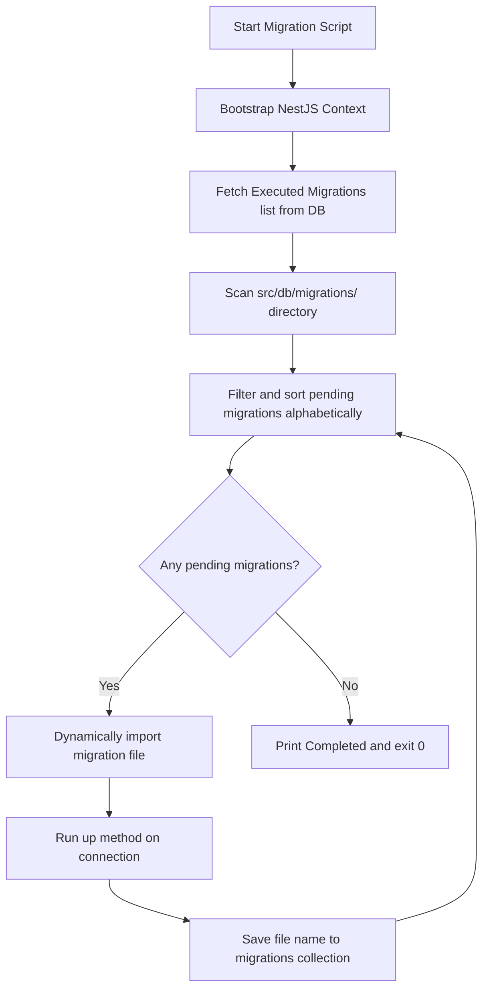

# Technical Specification: MongoDB Migration & Seeding System

This document describes the design, architecture, and usage of the custom database migration and idempotent seeding framework implemented for the NestJS + Mongoose (MongoDB) stack.

---

## 1. Architecture Overview

Since the application uses MongoDB (a NoSQL database) with Mongoose, the traditional SQL migration setups (such as TypeORM) are not applicable. Instead, we have developed a lightweight, native MongoDB migration and seeding runner using NestJS **standalone application contexts**.

### Standalone Context Pattern
Rather than starting the entire HTTP server (which binds to ports and listens to incoming requests), migration and seed scripts bootstrap a lightweight NestJS application container via `NestFactory.createApplicationContext(AppModule)`. This enables:
- Reuse of the exact same database connection details from `.env`.
- Reuse of Mongoose Schemas, ensuring compile-time safety and consistency.
- Automatic closing of connections and safe process exit upon completion.

---

## 2. Directory Structure

All database utility scripts, services, and modules are organized within the `src/db/` directory:

```
src/db/
├── migrations/                     # Directory containing chronological migration scripts
│   └── 1717459200000-init-indexes.ts # Initial migration to setup text and compound indexes
├── database-migration.service.ts   # Core service managing migration discovery & execution
├── database-seed.service.ts        # Service housing idempotent seeder data and logic
├── db.module.ts                    # NestJS module registering mongoose schemas for DB actions
├── migrate.ts                      # CLI entry point to execute migrations
├── migration.schema.ts             # Schema for tracking executed migrations
├── seed.ts                         # CLI entry point to execute seeding
└── verify.ts                       # CLI entry point to print current DB statistics
```

---

## 3. Database Schema: Migrations

To keep track of which migration scripts have already run, a `migrations` collection is automatically created and managed by Mongoose.

### Migration Schema Definition (`migration.schema.ts`)
```typescript
import { Prop, Schema, SchemaFactory } from '@nestjs/mongoose';
import { Document, Schema as MongooseSchema } from 'mongoose';

@Schema({
  timestamps: { createdAt: 'executed_at', updatedAt: false },
  collection: 'migrations',
})
export class MigrationDocument extends Document {
  @Prop({ required: true, unique: true })
  name: string; // Must match the filename without the .ts extension
}

export const MigrationSchema: MongooseSchema = SchemaFactory.createForClass(MigrationDocument);
```

---

## 4. How Migrations Work

The `DatabaseMigrationService` performs the following steps when triggered:



### Migration Code Template
All migration files must default-export an object containing `name`, `up`, and `down` methods:
```typescript
import * as mongoose from 'mongoose';

export default {
  name: '1717500000000-descriptive-name',

  async up(connection: mongoose.Connection): Promise<void> {
    const db = connection.db;
    if (db) {
      // Execute database upgrades here (e.g. createIndex, renameCollection, updateMany)
    }
  },

  async down(connection: mongoose.Connection): Promise<void> {
    const db = connection.db;
    if (db) {
      // Execute database rollbacks here (e.g. dropIndex, revert updates)
    }
  }
};
```

---

## 5. How Seeding Works (Idempotent Seeding)

Seeding loads baseline records and testing datasets. It is designed to be **idempotent**, meaning running `npm run db:seed` multiple times will never result in duplicate records.

### Seeding Steps:
1. **Users**: Checks if `admin@farmy.com` and `user@farmy.com` exist; if not, hashes password via `bcrypt` and inserts them.
2. **Farm Plots**: Looks up plots for the seeded user. If `'Vườn táo phía Bắc'` and `'Nhà màng cà chua'` do not exist, they are inserted.
3. **Diaries**: Creates crop journals for Apple and Tomato only if they don't already exist on those plots.
4. **Diary Logs & Reminders**: Checks if identical activities or reminders exist before creating them.

---

## 6. Command Reference

All CLI commands are registered in `package.json` and executed using `ts-node` alongside path registration to support absolute paths (`@/...` imports).

| Command | Script / Target | Description |
| :--- | :--- | :--- |
| `npm run db:migrate` | `src/db/migrate.ts` | Runs all pending migrations. |
| `npm run db:seed` | `src/db/seed.ts` | Seeds the database with idempotent mock datasets. |
| `npm run db:verify` | `src/db/verify.ts` | Connects, queries, and prints count/contents of all collections in the active database. |

---

## 7. Verification Results

Running `npm run db:verify` fetches and logs data from the target database (e.g., `Farm_Diaries` or `test` depending on [.env](file:///Users/mac/Study/Chuyên%20ngành%207/Project/farmy-backend/.env)), confirming connection status and schema integrity:

```
Bootstrapping verification application context...

========================================================================
                 DATABASE CONTENT VERIFICATION RESULTS                  
========================================================================

👥 Users (3):
  - Name: Farmy Admin, Email: admin@farmy.com, Role: admin
  - Name: Nguyễn Văn Ruộng, Email: user@farmy.com, Role: user

🏡 Farm Plots (3):
  - Name: Vườn Cam sau nhà, Area: 500.5m²
  - Name: Vườn táo phía Bắc, Area: 1500m²

📓 Diaries (3):
  - Crop: Cam, Status: active
  - Crop: Táo Fuji, Status: active

⚙️ Executed Migrations (1):
  - Name: 1717459200000-init-indexes

========================================================================
```
