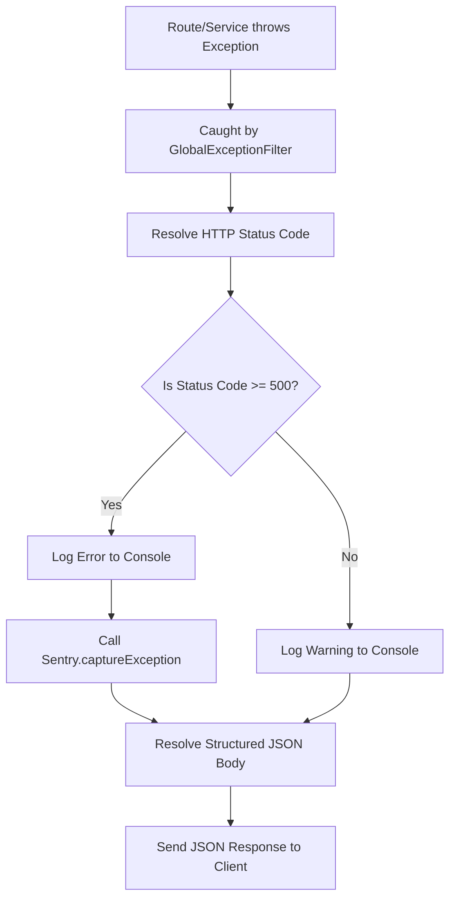

# Technical Specification: Global Exception Filter & Sentry Integration

This document describes the design, architecture, and usage of the unified `GlobalExceptionFilter` and the Sentry Error Tracking integration implemented for the NestJS backend application.

---

## 1. Architecture Overview

To ensure high availability and clean client interaction, all unhandled exceptions thrown across HTTP routes and modules are intercepted. The core objectives of this architecture are:
- **Consistent Error Format**: All clients receive a structured JSON response regardless of where or how the error occurred.
- **Automated Error Tracking**: Unexpected server-side issues (5xx status codes and generic runtime errors) are automatically dispatched to Sentry for logging and alerting.
- **Client Error Noise Reduction**: Client-side errors (4xx validation, unauthorized access, etc.) are formatted and sent to the client but excluded from Sentry reporting to avoid log pollution.

---

## 2. Directory Structure & File Association

The exception handling and error tracking setup is composed of the following files:

```
src/
├── common/
│   └── filters/
│       ├── global-exception.filter.ts       # Main exception interceptor and formatter
│       └── global-exception.filter.spec.ts  # Isolated Jest unit tests for the filter
├── main.ts                                  # App entry point initializing Sentry SDK
├── app.module.ts                            # Registration of GlobalExceptionFilter as APP_FILTER
```

In addition, environment files specify Sentry access coordinates:
- `.env` & `.env.example` (Configures the `SENTRY_DSN` variable).

---

## 3. Exception Lifecycle Flow

The exception interception flow follows this path:



---

## 4. Error Response Format Specification

The filter standardizes all error payloads into a unified JSON structure:

```json
{
  "success": false,
  "statusCode": 400,
  "errorCode": "BAD_REQUEST",
  "message": "Invalid password length",
  "timestamp": "2026-06-07T00:30:15.000Z"
}
```

### Mapping Logic Details

1. **HTTP Status Code resolution**:
   - Resolved dynamically using `exception.getStatus()` if it is an instance of `HttpException`.
   - Defaults to `HttpStatus.INTERNAL_SERVER_ERROR` (500) for all other native `Error` or unhandled occurrences.
2. **Error Code (`errorCode`) mapping**:
   - If the exception returns a response object (e.g. `validationResponse`), the filter extracts `errorCode` or `error` if present. If neither is specified, it defaults to `'BAD_REQUEST'`.
   - If the exception returns a plain string, `errorCode` is resolved to the corresponding status name (e.g. `'BAD_REQUEST'` for 400) using `HttpStatus[status]`.
   - For `401 Unauthorized` responses without custom errorCodes, it is automatically resolved as `'AUTH_INVALID_TOKEN'`.
3. **Message Concatenation**:
   - Class Validator exceptions returning array messages are automatically joined with commas (e.g., `'email must be an email, password must be longer than 6 characters'`).

---

## 5. Sentry Integration Setup

### Initialization (`main.ts`)
Sentry must be initialized at the very top of `main.ts` prior to NestJS bootstrapping to intercept imports and initialize profiling hooks correctly:

```typescript
import * as dotenv from 'dotenv';
dotenv.config();

import * as Sentry from '@sentry/nestjs';

Sentry.init({
  dsn: process.env.SENTRY_DSN,
  tracesSampleRate: 1.0,
});
```

### Local Development Behavior
If no `SENTRY_DSN` is specified in the local `.env` file, the Sentry client initializes as disabled and ignores reports, preventing pollution of error tracking platforms during local development.

---

## 6. Verification and Testing

### Running Tests
To run unit tests specifically for the Exception Filter and Sentry routing:

```bash
npm run test src/common/filters/global-exception.filter.spec.ts
```

### Output of Test Suite
```bash
PASS src/common/filters/global-exception.filter.spec.ts
  GlobalExceptionFilter
    ✓ should be defined (6 ms)
    ✓ should catch HttpException and format structured JSON response (no Sentry capture for < 500) (3 ms)
    ✓ should catch 500 Server Error, call Sentry.captureException, and format structured JSON response (6 ms)
    ✓ should catch non-HttpException, default to 500 status, call Sentry.captureException, and format response (1 ms)
    ✓ should format message from array response in validation errors (2 ms)
```
